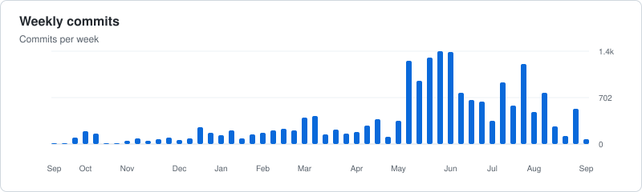
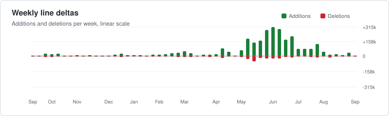

[sent-tech.ca](https://www.sent-tech.ca/)

<!-- github-profile-stats:start -->
## GitHub activity

Top 5 recent repos

| Repo | Derniere activite | Commits (4 sem.) | Lignes modifiees (4 sem.) |
| --- | --- | --- | --- |
| rhanka/openerp | 2026-05-06 | 15 | 2798 |
| rhanka/public-domaine-mystery-sagas-pack | 2026-05-06 | 3 | 210762 |
| rhanka/sent-tech-design-system | 2026-05-06 | 25 | 5975 |
| rhanka/surch | 2026-05-06 | 56 | 37053 |
| rhanka/rhanka | 2026-05-06 | 1 | 3581 |

<!-- github-profile-stats:end -->
